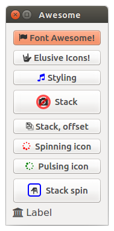

QtAwesome - Iconic Fonts in PyQt and PySide applications
========================================================

## Description

QtAwesome enables iconic fonts such as Font Awesome and Elusive Icons in PyQt and PySide applications.

It started as a port to Python of the QtAwesome C++ library by Rick Blommers.

## Installation

```python
pip install qtawesome
```

## Examples

```python
import qtawesome as qta
```

- Use Font Awesome and Elusive Icons.

```python
# Get icons by name.
fa_icon = qta.icon('fa.flag')
fa_button = QtGui.QPushButton(fa_icon, 'Font Awesome!')

asl_icon = qta.icon('ei.asl')
elusive_button = QtGui.QPushButton(asl_icon, 'Elusive Icons!')
```

- Apply some styling

```python
# Styling icons
styling_icon = qta.icon('fa.music',
                        active='fa.legal',
                        color='blue',
                        color_active='orange')
music_button = QtGui.QPushButton(styling_icon, 'Styling')
```

- Stack multiple icons

```python
# Stacking icons
camera_ban = qta.icon('fa.camera', 'fa.ban',
                      options=[{'scale_factor': 0.5,
                                'active': 'fa.legal'},
                               {'color': 'red'}])
stack_button = QtGui.QPushButton(camera_ban, 'Stack')
stack_button.setIconSize(QtCore.QSize(32, 32))
```

- Animations

```python
# Spining icons
spin_button = QtGui.QPushButton(' Spinning icon')
spin_icon = qta.icon('fa.spinner', color='red',
                     animation=qta.Spin(spin_button))
spin_button.setIcon(spin_icon)
```

- Screenshot



## Other features

- QtAwesome comes bundled with Font Awesome and Elusive Icons, but it can also be used with other iconic fonts. The `load_font` function allows to load other fonts dynamically.
- QtAwesome relies on the [QtPy](https://github.com/spyder-ide/qtpy.git) project as a compatibility layer on the top ot PyQt or PySide.

## License

MIT License. Copyright 2015 - The Spyder development team.
See the [LICENSE](LICENSE) file for details.

The Font Awesome and Elusive Icons fonts are licensed under the SIL Open Font License.

