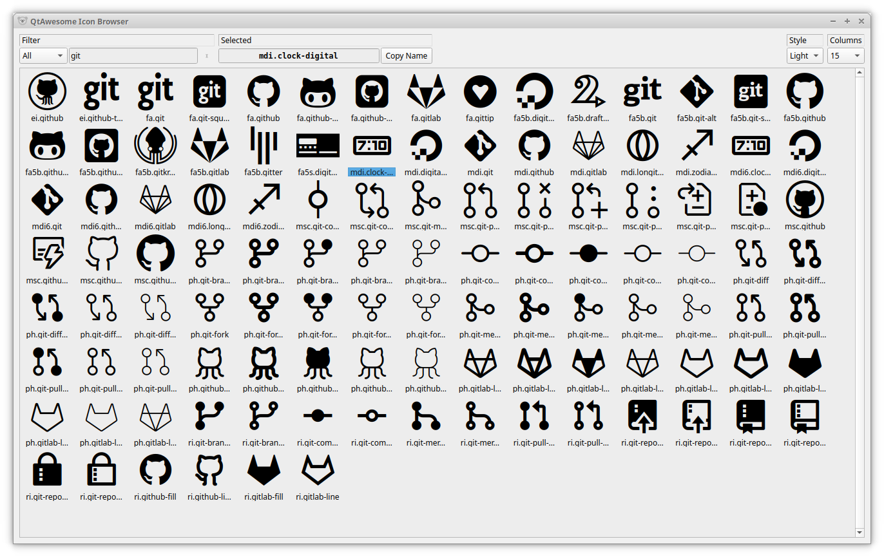

# QtAwesome

[](./LICENSE)
[](https://pypi.org/project/qtawesome/)
[](https://www.anaconda.com/download/)
[](https://www.anaconda.com/download/)
[](#backers)
[](https://gitter.im/spyder-ide/public)<br>
[](https://github.com/spyder-ide/qtawesome)
[](https://github.com/spyder-ide/qtawesome/actions)
[](http://qtawesome.readthedocs.org/en/latest/?badge=latest)

*Copyright © 2015–2020 Spyder Project Contributors*


## Description

QtAwesome enables iconic fonts such as Font Awesome and Elusive Icons
in PyQt and PySide applications.

It started as a Python port of the [QtAwesome](
https://github.com/Gamecreature/qtawesome)
C++ library by Rick Blommers.


## Installation

Using `conda`:

```
conda install qtawesome
```

or using `pip` (only if you don't have conda installed):

```
pip install qtawesome
```


## Usage

### Supported Fonts

QtAwesome identifies icons by their **prefix** and their **icon name**, separated by a *period* (`.`) character.

The following prefixes are currently available to use:

- [**FontAwesome**](https://fontawesome.com):

  - FA 5.9.0 features 1,534 free icons in different styles:

    - `fa5` prefix has [151 icons in the "**regular**" style.](https://fontawesome.com/icons?d=gallery&s=regular&v=5.0.0,5.0.1,5.0.10,5.0.11,5.0.12,5.0.13,5.0.2,5.0.3,5.0.4,5.0.5,5.0.6,5.0.7,5.0.8,5.0.9,5.1.0,5.1.1,5.2.0,5.3.0,5.3.1,5.4.0,5.4.1,5.4.2,5.5.0,5.6.0,5.6.1,5.6.3,5.9.0&m=free)
    - `fa5s` prefix has [935 icons in the "**solid**" style.](https://fontawesome.com/icons?d=gallery&s=solid&v=5.0.0,5.0.1,5.0.10,5.0.11,5.0.12,5.0.13,5.0.2,5.0.3,5.0.4,5.0.5,5.0.6,5.0.7,5.0.8,5.0.9,5.1.0,5.1.1,5.2.0,5.3.0,5.3.1,5.4.0,5.4.1,5.4.2,5.5.0,5.6.0,5.6.1,5.6.3,5.9.0&m=free)
    - `fa5b` prefix has [413 icons of various **brands**.](https://fontawesome.com/icons?d=gallery&s=brands&v=5.0.0,5.0.1,5.0.10,5.0.11,5.0.12,5.0.13,5.0.2,5.0.3,5.0.4,5.0.5,5.0.6,5.0.7,5.0.8,5.0.9,5.1.0,5.1.1,5.2.0,5.3.0,5.3.1,5.4.0,5.4.1,5.4.2,5.5.0,5.6.0,5.6.1,5.6.3,5.9.0&m=free)

  - `fa` is the legacy [FA 4.7 version with its 675 icons](https://fontawesome.com/v4.7.0/icons/) but **all** of them (*and more!*) are part of FA 5.x so you should probably use the newer version above.

- `ei` prefix holds [**Elusive Icons** 2.0 with its 304 icons](http://elusiveicons.com/icons/).

- `mdi` prefix holds [**Material Design Icons** 4.9.95 with its 4995 icons.](https://cdn.materialdesignicons.com/4.9.95/)

### Examples

```python
import qtawesome as qta
```

- Use Font Awesome, Elusive Icons or Material Design Icons.

```python
# Get FontAwesome 5.x icons by name in various styles:
fa5_icon = qta.icon('fa5.flag')
fa5_button = QtWidgets.QPushButton(fa5_icon, 'Font Awesome! (regular)')
fa5s_icon = qta.icon('fa5s.flag')
fa5s_button = QtWidgets.QPushButton(fa5s_icon, 'Font Awesome! (solid)')
fa5b_icon = qta.icon('fa5b.github')
fa5b_button = QtWidgets.QPushButton(fa5b_icon, 'Font Awesome! (brands)')

# or Elusive Icons:
asl_icon = qta.icon('ei.asl')
elusive_button = QtWidgets.QPushButton(asl_icon, 'Elusive Icons!')

# or Material Design Icons:
apn_icon = qta.icon('mdi.access-point-network')
mdi_button = QtWidgets.QPushButton(apn_icon, 'Material Design Icons!')

```

- Apply some styling

```python
# Styling icons
styling_icon = qta.icon('fa5s.music',
                        active='fa5s.balance-scale',
                        color='blue',
                        color_active='orange')
music_button = QtWidgets.QPushButton(styling_icon, 'Styling')
```

- Stack multiple icons

```python
# Stacking icons
camera_ban = qta.icon('fa5s.camera', 'fa5s.ban',
                      options=[{'scale_factor': 0.5,
                                'active': 'fa5s.balance-scale'},
                               {'color': 'red'}])
stack_button = QtWidgets.QPushButton(camera_ban, 'Stack')
stack_button.setIconSize(QtCore.QSize(32, 32))
```

- Animations

```python
# Spining icons
spin_button = QtWidgets.QPushButton(' Spinning icon')
spin_icon = qta.icon('fa5s.spinner', color='red',
                     animation=qta.Spin(spin_button))
spin_button.setIcon(spin_icon)
```

- Display Icon as a widget

```python
# Spining icon widget
spin_widget = qta.IconWidget()
spin_icon = qta.icon('mdi.loading', color='red',
                     animation=qta.Spin(spin_widget))
spin_widget.setIcon(spin_icon)

# Simple icon widget
simple_widget = qta.IconWidget('mdi.web', color='blue')
```

- Screenshot


## Other features

- QtAwesome comes bundled with _Font Awesome_, _Elusive Icons_ and _Material Design_
  _Icons_ but it can also be used with other iconic fonts. The `load_font`
  function allows to load other fonts dynamically.
- QtAwesome relies on the [QtPy](https://github.com/spyder-ide/qtpy.git)
  project as a compatibility layer on the top ot PyQt or PySide.

### Icon Browser

QtAwesome ships with a browser that displays all the available icons.  You can
use this to search for an icon that suits your requirements and then copy the
name that should be used to create that icon!

Once installed, run `qta-browser` from a shell to start the browser.




## License

MIT License. Copyright 2015 - The Spyder development team.
See the [LICENSE](LICENSE) file for details.

The Font Awesome, Elusive Icons and Material Design Icons fonts are licensed under the SIL Open Font License.


## Sponsors

Spyder and its subprojects are funded thanks to the generous support of

[](https://www.quansight.com/)[](https://numfocus.org/)

and the donations we have received from our users around the world through [Open Collective](https://opencollective.com/spyder/):

[](https://opencollective.com/spyder#support)
