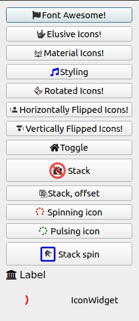

Usage
-----

Supported Fonts
~~~~~~~~~~~~~~~

QtAwesome identifies icons by their **prefix** and their **icon name**, separated by a *period* (``.``) character.

The following prefixes are currently available to use:

-  `FontAwesome`_:

   -  FA 5.9.0 features 1,534 free icons in different styles:

      -  ``fa5`` prefix has `151 icons in the "regular" style.`_
      -  ``fa5s`` prefix has `935 icons in the "solid" style.`_
      -  ``fa5b`` prefix has `413 icons of various brands.`_

   -  ``fa`` is the legacy `FA 4.7 version with its 675 icons`_ but
      **all** of them (*and more!*) are part of FA 5.x so you should
      probably use the newer version above.

-  ``ei`` prefix holds `Elusive Icons 2.0 with its 304 icons`_.

-  ``mdi`` prefix holds `Material Design Icons 4.9.95 with its 4995
   icons.`_

.. _FontAwesome: https://fontawesome.com
.. _151 icons in the "regular" style.: https://fontawesome.com/icons?d=gallery&s=regular&v=5.0.0,5.0.1,5.0.2,5.0.3,5.0.4,5.0.5,5.0.6,5.0.7,5.0.8,5.0.9,5.0.10,5.0.11,5.0.12,5.0.13,5.1.0,5.1.1,5.2.0,5.3.0,5.3.1,5.4.0,5.4.1,5.4.2,5.5.0,5.6.0,5.6.1,5.6.3&m=free
.. _915 icons in the "solid" style.: https://fontawesome.com/icons?d=gallery&s=solid&v=5.0.0,5.0.1,5.0.2,5.0.3,5.0.4,5.0.5,5.0.6,5.0.7,5.0.8,5.0.9,5.0.10,5.0.11,5.0.12,5.0.13,5.1.0,5.1.1,5.2.0,5.3.0,5.3.1,5.4.0,5.4.1,5.4.2,5.5.0,5.6.0,5.6.1,5.6.3&m=free
.. _414 icons of various brands.: https://fontawesome.com/icons?d=gallery&s=brands&v=5.0.0,5.0.1,5.0.2,5.0.3,5.0.4,5.0.5,5.0.6,5.0.7,5.0.8,5.0.9,5.0.10,5.0.11,5.0.12,5.0.13,5.1.0,5.1.1,5.2.0,5.3.0,5.3.1,5.4.0,5.4.1,5.4.2,5.5.0,5.6.0,5.6.1,5.6.3&m=free
.. _FA 4.7 version with its 675 icons: https://fontawesome.com/v4.7.0/icons/
.. _Elusive Icons 2.0 with its 304 icons: http://elusiveicons.com/icons/
.. _Material Design Icons 4.9.95 with its 4995 icons.: https://cdn.materialdesignicons.com/4.9.95/

Examples
~~~~~~~~

.. code:: python

   import qtawesome as qta

-  Use Font Awesome, Elusive Icons or Material Design Icons:

.. code:: python

   # Get FontAwesome 5.x icons by name in various styles by name
   fa5_icon = qta.icon('fa5.flag')
   fa5_button = QtWidgets.QPushButton(fa5_icon, 'Font Awesome! (regular)')

   fa5s_icon = qta.icon('fa5s.flag')
   fa5s_button = QtWidgets.QPushButton(fa5s_icon, 'Font Awesome! (solid)')

   fa5b_icon = qta.icon('fa5b.github')
   fa5b_button = QtWidgets.QPushButton(fa5b_icon, 'Font Awesome! (brands)')

   # Get Elusive icons by name
   asl_icon = qta.icon('ei.asl')
   elusive_button = QtWidgets.QPushButton(asl_icon, 'Elusive Icons!')

   # Get Material Design icons by name
   apn_icon = qta.icon('mdi.access-point-network')
   mdi_button = QtWidgets.QPushButton(apn_icon, 'Material Design Icons!')

-  Apply some transformations:

.. code:: python

   # Rotated
   rot_icon = qta.icon('mdi.access-point-network', rotated=45)
   rot_button = QtWidgets.QPushButton(rot_icon, 'Rotated Icons!')

   # Horizontal flip
   hflip_icon = qta.icon('mdi.account-alert', hflip=True)
   hflip_button = QtWidgets.QPushButton(hflip_icon, 'Horizontally Flipped Icons!')

   # Vertical flip
   vflip_icon = qta.icon('mdi.account-alert', vflip=True)
   vflip_button = QtWidgets.QPushButton(vflip_icon, 'Vertically Flipped Icons!')

-  Apply some styling:

.. code:: python

   # Styling
   styling_icon = qta.icon('fa5s.music',
                           active='fa5s.balance-scale',
                           color='blue',
                           color_active='orange')
   music_button = QtWidgets.QPushButton(styling_icon, 'Styling')

-  Apply toggling state styling:

.. code:: python

   # Toggle
   toggle_icon = qta.icon('fa5s.home', selected='fa5s.balance-scale',
                           color_off='black',
                           color_off_active='blue',
                           color_on='orange',
                           color_on_active='yellow')
   toggle_button = QtWidgets.QPushButton(toggle_icon, 'Toggle')
   toggle_button.setCheckable(True)

-  Stack multiple icons:

.. code:: python

   # Stack icons
   camera_ban = qta.icon('fa5s.camera', 'fa5s.ban',
                        options=[{'scale_factor': 0.5,
                                    'active': 'fa5s.balance-scale'},
                                 {'color': 'red', 'opacity': 0.7}])
   stack_button = QtWidgets.QPushButton(camera_ban, 'Stack')
   stack_button.setIconSize(QtCore.QSize(32, 32))

   # Stack and offset icons
   saveall = qta.icon('fa5.save', 'fa5.save',
                     options=[{'scale_factor': 0.8,
                                 'offset': (0.2, 0.2),
                                 'color': 'gray'},
                              {'scale_factor': 0.8}])
   saveall_button = QtWidgets.QPushButton(saveall, 'Stack, offset')

-  Animations:

.. code:: python

   # Spin icons
   spin_button = QtWidgets.QPushButton(' Spinning icon')
   spin_icon = qta.icon('fa5s.spinner', color='red',
                        animation=qta.Spin(spin_button))
   spin_button.setIcon(spin_icon)

   # Pulse icons
   pulse_button = QtWidgets.QPushButton(' Pulsing icon')
   pulse_icon = qta.icon('fa5s.spinner', color='green',
                        animation=qta.Pulse(pulse_button))
   pulse_button.setIcon(pulse_icon)

   # Stacked spin icons
   stack_spin_button = QtWidgets.QPushButton('Stack spin')
   options = [{'scale_factor': 0.4,
               'animation': qta.Spin(stack_spin_button)},
               {'color': 'blue'}]
   stack_spin_icon = qta.icon('ei.asl', 'fa5.square',
                              options=options)
   stack_spin_button.setIcon(stack_spin_icon)
   stack_spin_button.setIconSize(QtCore.QSize(32, 32))

-  Apply font label rendering:

.. code:: python

   # Render a label with this font
   label = QtWidgets.QLabel(unichr(0xf19c) + ' ' + 'Label')
   label.setFont(qta.font('fa', 16))

- Display Icon as a widget:

.. code:: python

   # Spining icon widget
   spin_widget = qta.IconWidget()
   spin_icon = qta.icon('mdi.loading', color='red',
                        animation=qta.Spin(spin_widget))
   spin_widget.setIcon(spin_icon)
   
   # simple widget
   simple_widget = qta.IconWidget('mdi.web', color='blue')

Screenshot
~~~~~~~~~~

