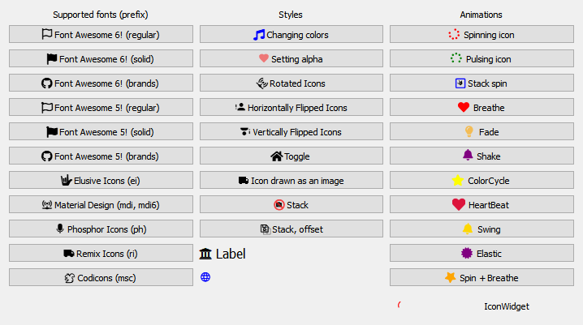

Usage
-----

Supported Fonts
~~~~~~~~~~~~~~~

QtAwesome identifies icons by their **prefix** and their **icon name**, separated by a *period* (``.``) character.

The following prefixes are currently available to use:

-  `FontAwesome`_:

   - FA 6.7.2 features 2,060 free icons in different styles:

      - ``fa6`` prefix has `163 icons in the "regular" style.`_
      - ``fa6s`` prefix has `1402 icons in the "solid" style.`_
      - ``fa6b`` prefix has `495 icons of various brands.`_

   -  FA 5.15.4 features 1,608 free icons in different styles:

      -  ``fa5`` prefix has `151 icons in the "regular" style.`_
      -  ``fa5s`` prefix has `1001 icons in the "solid" style.`_
      -  ``fa5b`` prefix has `456 icons of various brands.`_

-  ``ei`` prefix holds `Elusive Icons 2.0 with its 304 icons`_.

-  `Material Design Icons`_:

   -  ``mdi6`` prefix holds `Material Design Icons 6.9.96 with its 6997 icons.`_

   -  ``mdi`` prefix holds `Material Design Icons 5.9.55 with its 5955 icons.`_

- ``ph`` prefix holds `Phosphor 1.3.0 with its 4470 icons (894 icons * 5 weights: Thin, Light, Regular, Bold and Fill).`_

- ``ri`` prefix holds `Remix Icon 2.5.0 with its 2271 icons.`_

- ``msc`` prefix holds Microsoft's `Codicons 0.0.36 with its 569 icons.`_

.. _FontAwesome: https://fontawesome.com
.. _163 icons in the "regular" style.: https://fontawesome.com/v6/search?o=r&ic=free&s=regular
.. _1402 icons in the "solid" style.: https://fontawesome.com/v6/search?o=r&ic=free&s=solid
.. _495 icons of various brands.: https://fontawesome.com/v6/search?o=r&ic=free&ip=brands
.. _151 icons in the "regular" style.: https://fontawesome.com/v5/search?o=r&ic=free&s=regular
.. _1001 icons in the "solid" style.: https://fontawesome.com/v5/search?o=r&ic=free&s=solid
.. _456 icons of various brands.: https://fontawesome.com/v5/search?ic=brands
.. _Elusive Icons 2.0 with its 304 icons: http://elusiveicons.com/icons/
.. _Material Design Icons: https://pictogrammers.com/library/mdi/
.. _Material Design Icons 6.9.96 with its 6997 icons.: https://cdn.materialdesignicons.com/6.9.96/
.. _Material Design Icons 5.9.55 with its 5955 icons.: https://cdn.materialdesignicons.com/5.9.55/
.. _Phosphor 1.3.0 with its 4470 icons (894 icons * 5 weights\: Thin, Light, Regular, Bold and Fill).: https://github.com/phosphor-icons/phosphor-icons
.. _Remix Icon 2.5.0 with its 2271 icons.: https://github.com/Remix-Design/RemixIcon
.. _Codicons 0.0.36 with its 569 icons.: https://github.com/microsoft/vscode-codicons

Examples
~~~~~~~~

.. code:: python

   import qtawesome as qta

-  Use Font Awesome, Elusive Icons, Material Design Icons, Phosphor, Remix Icon or Microsoft's Codicons:

.. code:: python

   # Get FontAwesome 6.x icons by name in various styles:
   fa6_icon = qta.icon('fa6.flag')
   fa6_button = QtWidgets.QPushButton(fa6_icon, 'Font Awesome 6! (regular)')

   fa6s_icon = qta.icon('fa6s.flag')
   fa6s_button = QtWidgets.QPushButton(fa6s_icon, 'Font Awesome 6! (solid)')

   fa6b_icon = qta.icon('fa6b.github')
   fa6b_button = QtWidgets.QPushButton(fa6b_icon, 'Font Awesome 6! (brands)')

   # Get FontAwesome 5.x icons by name in various styles:
   fa5_icon = qta.icon('fa5.flag')
   fa5_button = QtWidgets.QPushButton(fa5_icon, 'Font Awesome 5! (regular)')

   fa5s_icon = qta.icon('fa5s.flag')
   fa5s_button = QtWidgets.QPushButton(fa5s_icon, 'Font Awesome 5! (solid)')

   fa5b_icon = qta.icon('fa5b.github')
   fa5b_button = QtWidgets.QPushButton(fa5b_icon, 'Font Awesome 5! (brands)')

   # Get Elusive icons by name
   asl_icon = qta.icon('ei.asl')
   elusive_button = QtWidgets.QPushButton(asl_icon, 'Elusive Icons!')

   # Get Material Design icons 6.x by name
   apn_icon = qta.icon('mdi6.access-point-network')
   mdi6_button = QtWidgets.QPushButton(apn_icon, 'Material Design Icons!')

   # Get Phosphor by name
   mic_icon = qta.icon('ph.microphone-fill')
   ph_button = QtWidgets.QPushButton(mic_icon, 'Phosphor!')

   # Get Remix Icon by name
   truck_icon = qta.icon('ri.truck-fill')
   ri_button = QtWidgets.QPushButton(truck_icon, 'Remix Icon!')

   # Get Microsoft's Codicons by name
   squirrel_icon = qta.icon('msc.squirrel')
   msc_button = QtWidgets.QPushButton(squirrel_icon, 'Codicons!')

-  Apply some transformations:

.. code:: python

   # Rotated
   rot_icon = qta.icon('mdi.access-point-network', rotated=45)
   rot_button = QtWidgets.QPushButton(rot_icon, 'Rotated Icons!')

   # Horizontal flip
   hflip_icon = qta.icon('mdi.account-alert', hflip=True)
   hflip_button = QtWidgets.QPushButton(hflip_icon, 'Horizontally Flipped Icons!')

   # Vertical flip
   vflip_icon = qta.icon('mdi.account-alert', vflip=True)
   vflip_button = QtWidgets.QPushButton(vflip_icon, 'Vertically Flipped Icons!')

-  Apply some styling:

.. code:: python

   # Styling
   styling_icon = qta.icon('fa5s.music',
                           active='fa5s.balance-scale',
                           color='blue',
                           color_active='orange')
   music_button = QtWidgets.QPushButton(styling_icon, 'Styling')

- Set alpha in colors:

.. code:: python

   # Setting an alpha of 120 to the color of this icon. Alpha must be a number
   # between 0 and 255.
   icon_with_alpha = qta.icon('mdi.heart',
                              color=('red', 120))
   heart_button = QtWidgets.QPushButton(icon_with_alpha, 'Setting alpha')

-  Apply toggling state styling:

.. code:: python

   # Toggle
   toggle_icon = qta.icon('fa5s.home', selected='fa5s.balance-scale',
                           color_off='black',
                           color_off_active='blue',
                           color_on='orange',
                           color_on_active='yellow')
   toggle_button = QtWidgets.QPushButton(toggle_icon, 'Toggle')
   toggle_button.setCheckable(True)

- Define the way to draw icons (`text`- default for icons without animation, `path` - default for icons with animations, `glyphrun` and `image`):

.. code:: python

   # Icon drawn with the `image` option
   drawn_image_icon = qta.icon('ri.truck-fill',
                            options=[{'draw': 'image'}])
   drawn_image_button = QtWidgets.QPushButton(drawn_image_icon,
                                              'Icon drawn as an image')

-  Stack multiple icons:

.. code:: python

   # Stack icons
   camera_ban = qta.icon('fa5s.camera', 'fa5s.ban',
                        options=[{'scale_factor': 0.5,
                                    'active': 'fa5s.balance-scale'},
                                 {'color': 'red', 'opacity': 0.7}])
   stack_button = QtWidgets.QPushButton(camera_ban, 'Stack')
   stack_button.setIconSize(QtCore.QSize(32, 32))

   # Stack and offset icons
   saveall = qta.icon('fa5.save', 'fa5.save',
                     options=[{'scale_factor': 0.8,
                                 'offset': (0.2, 0.2),
                                 'color': 'gray'},
                              {'scale_factor': 0.8}])
   saveall_button = QtWidgets.QPushButton(saveall, 'Stack, offset')

-  Animations:

.. code:: python

   # -- Spin animation (continuous rotation)
   spin_button = QtWidgets.QPushButton(' Spinning icon')
   animation = qta.Spin(spin_button, step=2, interval=10)
   spin_icon = qta.icon('fa5s.spinner', color='red', animation=animation)
   spin_button.setIcon(spin_icon)

   # Stop animation when needed
   animation.stop()

   # -- Pulse animation (stepped rotation)
   pulse_button = QtWidgets.QPushButton(' Pulsing icon')
   animation = qta.Pulse(pulse_button, autostart=False)
   pulse_icon = qta.icon('fa5s.spinner', color='green', animation=animation)
   pulse_button.setIcon(pulse_icon)

   # Start and stop the animation when needed
   animation.start()
   animation.stop()

   # -- Breathe animation (scale pulsing)
   breathe_button = QtWidgets.QPushButton(' Breathing icon')
   animation = qta.Breathe(breathe_button, min_scale=0.8, max_scale=1.2, period=2000)
   breathe_icon = qta.icon('fa5s.heart', color='red', animation=animation)
   breathe_button.setIcon(breathe_icon)

   # -- Fade animation (opacity pulsing)
   fade_button = QtWidgets.QPushButton(' Fading icon')
   animation = qta.Fade(fade_button, min_opacity=0.2, max_opacity=1.0, period=2000)
   fade_icon = qta.icon('fa5s.lightbulb', color='orange', animation=animation)
   fade_button.setIcon(fade_icon)

   # -- HeartBeat animation (double pulse pattern)
   heartbeat_button = QtWidgets.QPushButton(' Heartbeat')
   animation = qta.HeartBeat(heartbeat_button, max_scale=1.3, period=1000)
   heartbeat_icon = qta.icon('fa5s.heart', color='red', animation=animation)
   heartbeat_button.setIcon(heartbeat_icon)

   # -- Swing animation (pendulum motion)
   swing_button = QtWidgets.QPushButton(' Swinging')
   animation = qta.Swing(swing_button, angle=15, period=1000)
   swing_icon = qta.icon('fa5s.bell', color='gold', animation=animation)
   swing_button.setIcon(swing_icon)

   # -- Shake animation (vibration)
   shake_button = QtWidgets.QPushButton(' Shaking')
   animation = qta.Shake(shake_button, amplitude_x=3, amplitude_y=3, period=200)
   shake_icon = qta.icon('fa5s.bell', color='orange', animation=animation)
   shake_button.setIcon(shake_icon)

   # -- Elastic animation (bounce with overshoot)
   elastic_button = QtWidgets.QPushButton(' Elastic')
   animation = qta.Elastic(elastic_button, min_scale=0.5, max_scale=1.0, period=1500)
   elastic_icon = qta.icon('fa5s.certificate', color='purple', animation=animation)
   elastic_button.setIcon(elastic_icon)

   # -- ColorCycle animation (cycle through colors)
   color_button = QtWidgets.QPushButton(' Color Cycle')
   animation = qta.ColorCycle(color_button, colors=['red', 'orange', 'yellow', 'green', 'blue'])
   color_icon = qta.icon('fa5s.star', animation=animation)
   color_button.setIcon(color_icon)

   # -- CompositeAnimation (combine multiple effects)
   composite_button = QtWidgets.QPushButton(' Composite')
   anim1 = qta.Spin(composite_button, step=2, autostart=False)
   anim2 = qta.Breathe(composite_button, min_scale=0.8, max_scale=1.2, autostart=False)
   animation = qta.CompositeAnimation(composite_button, [anim1, anim2])
   composite_icon = qta.icon('fa5s.star', color='orange', animation=animation)
   composite_button.setIcon(composite_icon)

   # -- Animation with duration (auto-stops after time)
   duration_button = QtWidgets.QPushButton(' Timed animation')
   animation = qta.Spin(duration_button, duration=3000)  # Stops after 3 seconds
   duration_icon = qta.icon('fa5s.hourglass', animation=animation)
   duration_button.setIcon(duration_icon)

   # -- Stacked spin icons
   stack_spin_button = QtWidgets.QPushButton('Stack spin')
   animation = qta.Spin(stack_spin_button)
   options = [{'scale_factor': 0.4,
               'animation': animation},
               {'color': 'blue'}]
   stack_spin_icon = qta.icon('ei.asl', 'fa5.square',
                              options=options)
   stack_spin_button.setIcon(stack_spin_icon)
   stack_spin_button.setIconSize(QtCore.QSize(32, 32))

-  Creating Custom Animations:

.. code:: python

   # Import utility functions for common patterns
   from qtawesome.animation import BaseAnimation, _sine_wave_value

   # Define your custom animation class
   class MyWobbleAnimation(BaseAnimation):
       """Custom wobble animation that moves icon horizontally."""

       def __init__(self, parent_widget, wobble_amount=10, period=1000, **kwargs):
           super().__init__(parent_widget, **kwargs)
           self.wobble_amount = wobble_amount
           self.period = period

       def _get_initial_state(self):
           return {'offset': 0}

       def _update_animation_state(self, elapsed, state):
           # Use utility function for sine wave oscillation
           state['offset'] = _sine_wave_value(
               elapsed, self.period, -self.wobble_amount, self.wobble_amount
           )

       def _apply_transform(self, icon_painter, painter, rect, state):
           # Apply horizontal translation
           painter.translate(state['offset'], 0)

   # Use your custom animation
   wobble_button = QtWidgets.QPushButton(' Custom Wobble')
   animation = MyWobbleAnimation(wobble_button, wobble_amount=15, period=800)
   wobble_icon = qta.icon('fa5s.star', color='purple', animation=animation)
   wobble_button.setIcon(wobble_icon)

-  Apply font label rendering:

.. code:: python

   # Render a label with this font
   label = QtWidgets.QLabel(unichr(0xf19c) + ' ' + 'Label')
   label.setFont(qta.font('fa', 16))

- Display Icon as a widget:

.. code:: python

   # -- Spinning icon widget
   spin_widget = qta.IconWidget()
   animation = qta.Spin(spin_widget)
   spin_icon = qta.icon('mdi.loading', color='red', animation=animation)
   spin_widget.setIcon(spin_icon)

   # Stop animation when needed
   animation.stop()

   # -- Simple widget
   simple_widget = qta.IconWidget('mdi.web', color='blue',
                                  size=QtCore.QSize(16, 16))

Screenshot
~~~~~~~~~~

